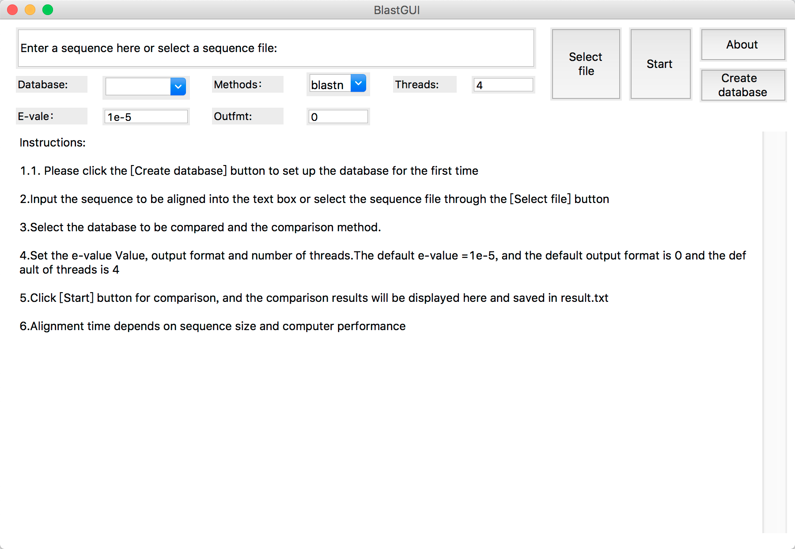

# BlastGUI

BlastGUI is A Python-Based Cross-Platform Local BLAST Visualization Software

## What does BlastGUI do?
Users can build databases and perform sequence filtering and sequence alignment through a graphical user interface. 
The operation visualization, automatic sequence filtering, and cross-platform use can significantly facilitate the analysis of biological data and the mining of biological information. 

## Running BlastGUI
Run BlastGUI on windows:
Put blastGUI.exe and BLAST+ in the same directory or add BLAST+ to the system environment, then run blastGUI.exe

Run BlastGUI on macOS or Linux：
First add BLAST+ to the system environment, then 
`python3 blastGUI.py`

## Results Files: BlastGUI Directory
1. **tmp.txt** is the filtered sequence text.
2. **result.txt** is the alignment result for the user to do futher analysis.
