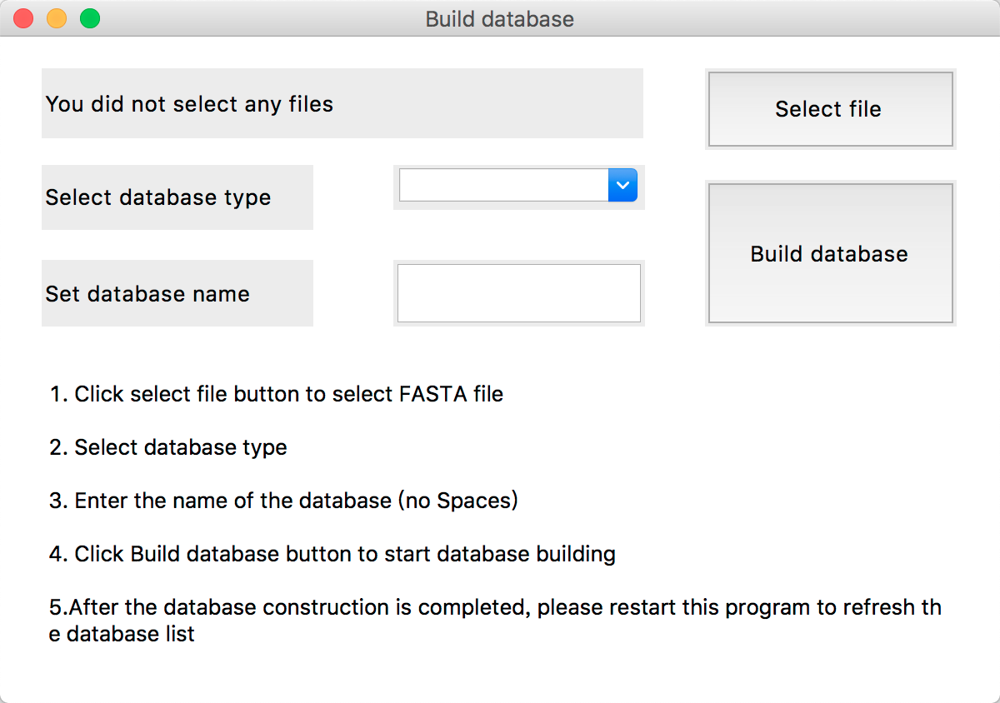

# BlastGUI

BlastGUI is A Python-Based Cross-Platform Local BLAST Visualization Software

## What does BlastGUI do
Users can build databases and perform sequence filtering and sequence alignment through a graphical user interface. 
The operation visualization, automatic sequence filtering, and cross-platform use can significantly facilitate the analysis of biological data and the mining of biological information. 

For more details see the BlastGUI paper below.

[Du, Z., Wu, Q., Wang, T., Chen, D., Huang, X., Yang, W., & Luo, W. (2020). BlastGUI: A Python‐based Cross‐platform Local BLAST Visualization Software. Molecular Informatics, 39(4), 1900120.](https://pubmed.ncbi.nlm.nih.gov/31650686/)

## Running BlastGUI
Run BlastGUI on windows:
Put blastGUI.exe and BLAST+ in the same directory or add BLAST+ to the system environment, then run blastGUI.exe

Run BlastGUI on macOS or Linux：
First add BLAST+ to the system environment, then 
`python3 blastGUI.py`

## How to use BlastGUI
When you use it for the first time, build the database first with [Build database] button.

### Build database

+ 1.Click select file button to select FASTA file 
- 2.Select database type 
+ 3.Enter the name of the database (no Spaces)            
- 4.Click Build database button to start database building             
+ 5.After the database construction is completed, please restart this program to refresh the database list

### Run BLAST

+ 1.Please click the [Build database] button to set up the database for the first time     
- 2.Input the sequence to be aligned into the text box or select the sequence file through the [Select file] button
+ 3.Select the database to be compared and the comparison method.
- 4.Set the e-value Value, output format and number of threads.The default e-value =1e-5, and the default output format is 0 and the default of threads is 4     
+ 5.(Optional) Any other command of BLAST like: -max_target_seqs 20 
- 6.Click [Start] button for comparison, and the comparison results will be displayed here and saved in result.txt
+ 7.Alignment time depends on sequence size and computer performance      
## Results Files: BlastGUI Directory
1. **tmp.txt** is the filtered sequence text.
2. **result.txt** is the alignment result for the user to do futher analysis.

## Download BlastGUI
Please download this software from [releases page](https://github.com/byemaxx/BlastGUI/releases).
